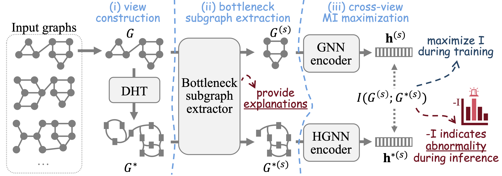

This is the source code of NeurIPS'23 paper "Towards Self-Interpretable Graph-Level Anomaly Detection" (SIGNET).



## Usage

### Step 1: prepare datasets

- Mutag:
1) Raw data files need to be downloaded at: https://github.com/flyingdoog/PGExplainer/tree/master/dataset
2) Unzip Mutagenicity.zip and Mutagenicity.pkl.zip
3) Put the raw data files in ./data/mutag/raw

- MNIST:
1) Raw data files need to be generated following the instructions at: https://github.com/bknyaz/graph_attention_pool/blob/master/scripts/mnist_75sp.sh
2) Put the generated files in ./data/mnist/raw

- Others:
Download and process automatically

### Step 2: run script line in scripts.sh

For example:
```
python main.py --dataset AIDS --epoch 1000 --lr 0.0001 --hidden_dim 16
```

## Semantic entropy CSV experiment

To run SIGNET on a semantic-uncertainty csv (e.g. `uncertainty.csv`) and analyze the relation between OOD score and `oracle`, use:

```bash
python run_semantic_entropy_signet.py \
  --csv_path /share/home/luenqiao/phx/data/no_preprompt/Mistral-7B-Instruct-v0.3/uncertainty.csv \
  --output_dir /share/home/luenqiao/phx/SIGNET/outputs/semantic_entropy \
  --feature_cols plugin cs cs-ggt cs-hybrid NumSets gt ggt ueigv hybrid-alphabet snne kle predictive surprise best-guess judge-llm-score \
  --epochs 200 \
  --oracle_quantile 0.8
```

Outputs:
- `semantic_signet_scores.csv`: per-graph OOD score and oracle.
- `semantic_signet_summary.json`: test AUC + Pearson/Spearman correlation.

## Semantic response-graph (NLI edges) experiment

For semantic-entropy style graph construction (node=response sample, edge=NLI entailment score):

```bash
python run_semantic_entropy_signet_nli.py \
  --json_path /share/home/luenqiao/phx/data/no_preprompt/Mistral-7B-Instruct-v0.3/hotpot_qa_final_labeled_results.json \
  --csv_path /share/home/luenqiao/phx/data/no_preprompt/Mistral-7B-Instruct-v0.3/uncertainty.csv \
  --output_dir /share/home/luenqiao/phx/SIGNET/outputs/semantic_entropy_nli \
  --max_responses 25 \
  --epochs 200
```

Outputs:
- `semantic_signet_nli_scores.csv`: per-question OOD score and oracle.
- `semantic_signet_nli_summary.json`: AUC + OOD-oracle correlations.

## Cite

If you compare with, build on, or use aspects of SIGNET, please cite the following:
```
@inproceedings{liu2023towards,
  title={Towards self-interpretable graph-level anomaly detection},
  author={Liu, Yixin and Ding, Kaize and Lu, Qinghua and Li, Fuyi and Zhang, Leo Yu and Pan, Shirui},
  booktitle={Advances in Neural Information Processing Systems},
  volume={36},
  year={2023}
}
```
