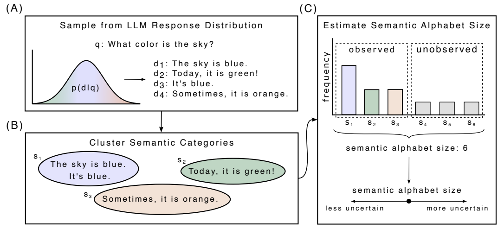

# Code for paper: *Estimating Semantic Alphabet Size for LLM Uncertainty Quantification* (ICLR '26).



## Table of Contents

* [Table of Contents](#table-of-contents)
* [Installation](#installation)
* [Example](#example)
* [Repo Overview](#repo-overview)
* [Citation](#citation)
* [License](#license)

## Installation

Clone our repo:

```bash
>>> git clone https://github.com/lucasmccabe/esa.git
```

Install dependencies:

```bash
>>> pip install -r requirements.txt
>>> pip install -r requirements_data.txt
```

## Example

A simple example, running from the root directory, is shown below:

```python
from src import EntropyEstimator, TextPassages

text_passages = TextPassages(
    passages=[
        "The sky is blue.",
        "It's blue.",
        "Today, it is green!",
        "Sometimes, it is orange"
    ],
    question = "What color is the sky?"
)

entropy_estimator = EntropyEstimator(
    text_passages=text_passages,
    cluster_ids=[0,0,1,2]
)

print(f"Plugin entropy estimate: {entropy_estimator.get_entropy():.2f}")
print(f"Hybrid entropy estimate: {entropy_estimator.get_entropy("hybrid"):.2f}")
```

Output:

```bash
Plugin entropy estimate: 1.04
Hybrid entropy estimate: 1.76
```

## Repo Overview

### Scripts

The scripts found in `scripts` and `src/experiments/collect_data` pertain to LLM response generation and LLM-as-judge evaluation. These require running the Docker container for vLLM, as defined as `compose.yaml`. Semantic equivalence class labels for LLM responses are obtained via `src/experiments/semantic_labeling.py`. `src/experiments/collect_alphabet.py` collects alphabet size estimation information and packages it in a CSV that is more convenient for analysis. Similarly, `src/experiments/collect_uncertainty.py` does the same for uncertainty measures.


### Figures and Tables

With the exception of Figure 1, which is an illustration, the underlying content for the figures and tables in the paper are generated via notebooks found in `src/experiments`.

- `src/experiments/Uncertainty Estimation.ipynb` corresponds to the content of Figures 2, 7, 8 and Table 1;
- `src/experiments/Incorrectness.ipynb` corresponds to the content of Figures 3, 4, 10 and Table 3;
- `src/experiments/MEAT and POTATO.ipynb` corresponds to the content of Figure 5 and Table 2;
- `src/experiments/Information Gain.ipynb` corresponds to the content of Figure 6;
- `src/experiments/Gemma-3-12B POTATO Examination.ipynb` corresponds to the content of Figure 9;
- `src/experiments/RBMCI vs Empirical.ipynb` corresponds to the content of Table 4; and
- `src/experiments/Alphabet Size Estimation.ipynb` corresponds to the content of Figure 11.


## Citation

To cite this work, please use the following:

```bibtex
@inproceedings{
    mccabe2026estimating,
    title={Estimating Semantic Alphabet Size for {LLM} Uncertainty Quantification},
    author={Lucas Hurley McCabe and Rimon Melamed and Thomas Hartvigsen and H Howie Huang},
    booktitle={The Fourteenth International Conference on Learning Representations},
    year={2026},
    url={https://openreview.net/forum?id=uYK6GPVg1O}
}
```

## License

This project is licensed under [GPL-3.0](LICENSE).